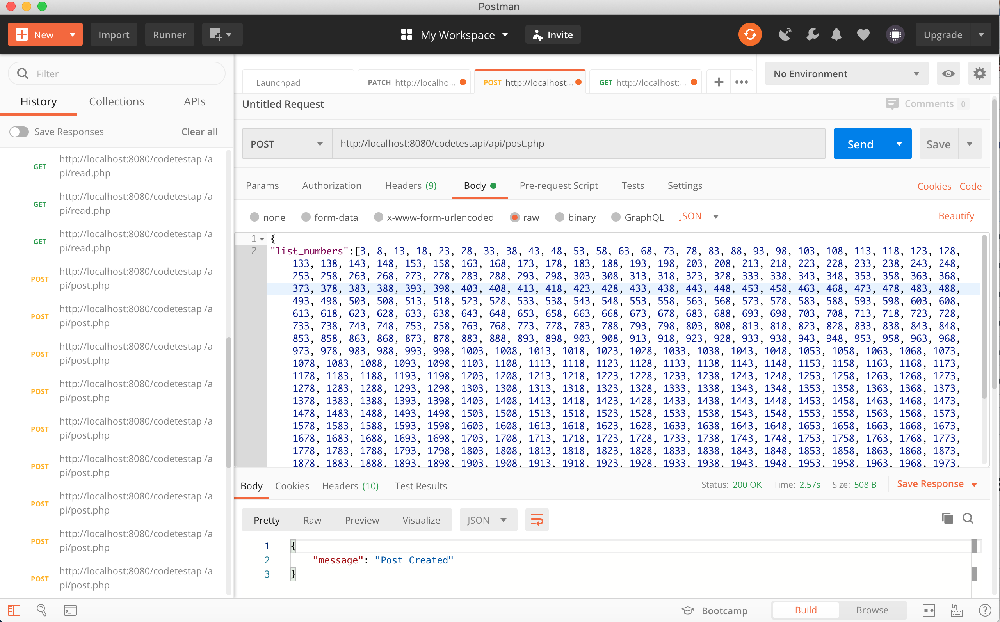
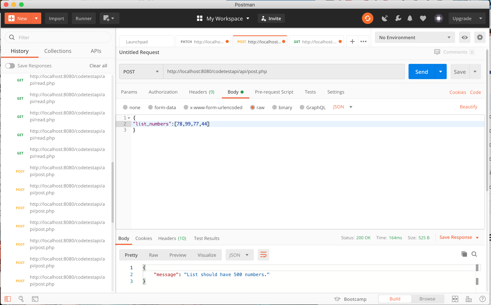
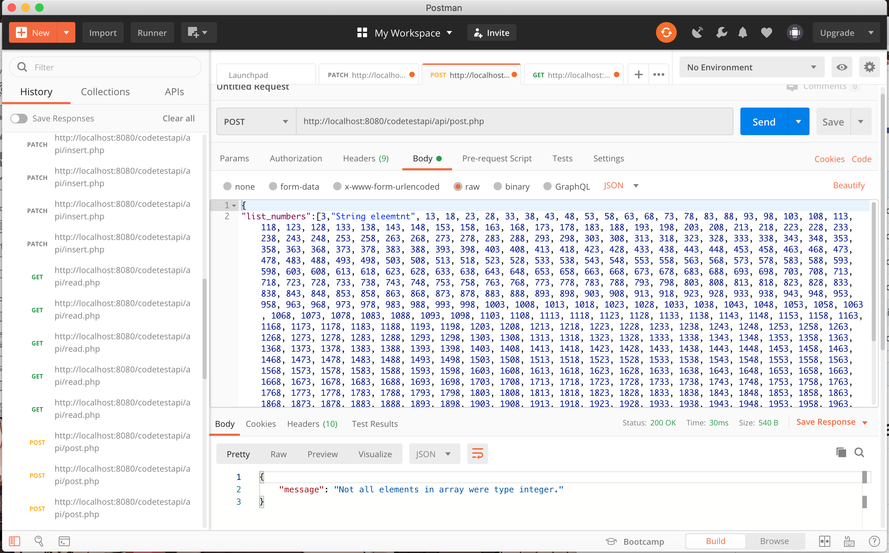
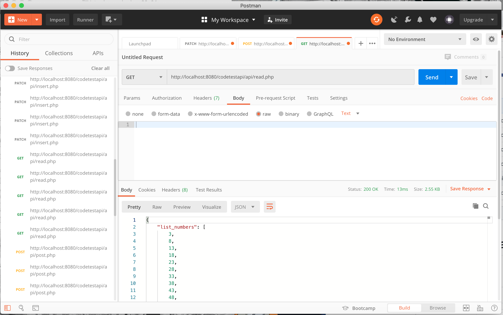
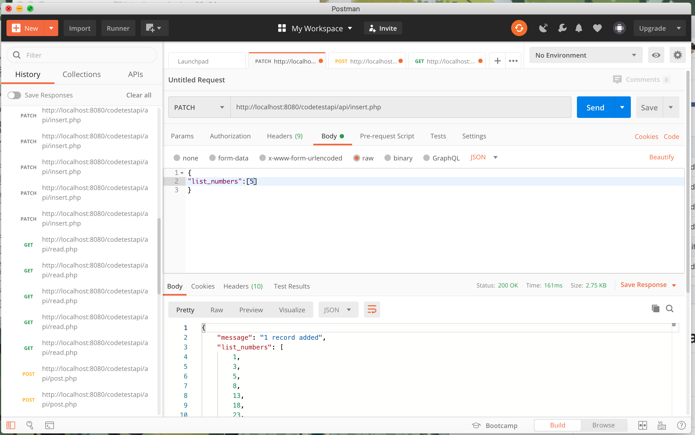

# HeadStorm-Back-end-challenge
Here is the solution of 2nd back end coding challenge for Headstorm

Site link:https://www.headstorm.com/challenge/

Github Link:https://github.com/Headstorm/Interview/blob/master/challenges/README.md

##### Question

___
Back End Challenge
Create a REST API using any language or web framework you prefer, which performs the following functionality:

<!-- UL -->

* Provides a POST endpoint at /data where a user submits a JSON formatted list of 500 random numbers. The list has to be exactly 500 numbers, if there are more or less than 500 an error must be returned. Similarly, if something other than a list of numbers is submitted, an error must be returned.
* Provides a GET endpoint at /data which provides the same JSON formatted list of 500 numbers that are sorted from lowest to highest.

**BONUS:**

<!-- UL -->

* Provides a PATCH endpoint at /data which allows insertion of a single number into the list which gets placed in the proper order.
___

The Structure of the code has 3 folders config, models, functions. Config folder Database.php which has all the credentials to our database and I
have provided sql file. Functions folder has function.php which has all the function to create, delete and read records. Models folder has 3 files based on 3 requirements 1st is post.php to pass the json file and it will return 'success post' if completed else 'not 500', 'not all string' or 'something went wrong' message and then is read.php which is for the get request to show records lowest to highest and lastly insert.php for the patch request.

###### Note:
Json doc is provided to test the api.

### Solution Screenshots of the work:

