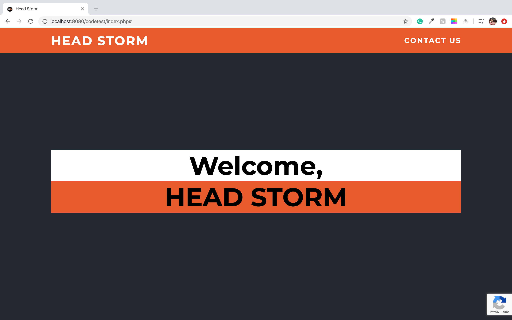
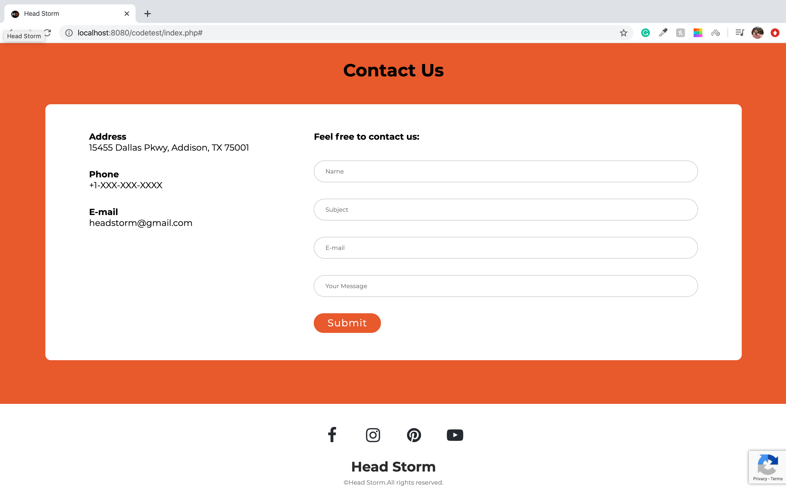
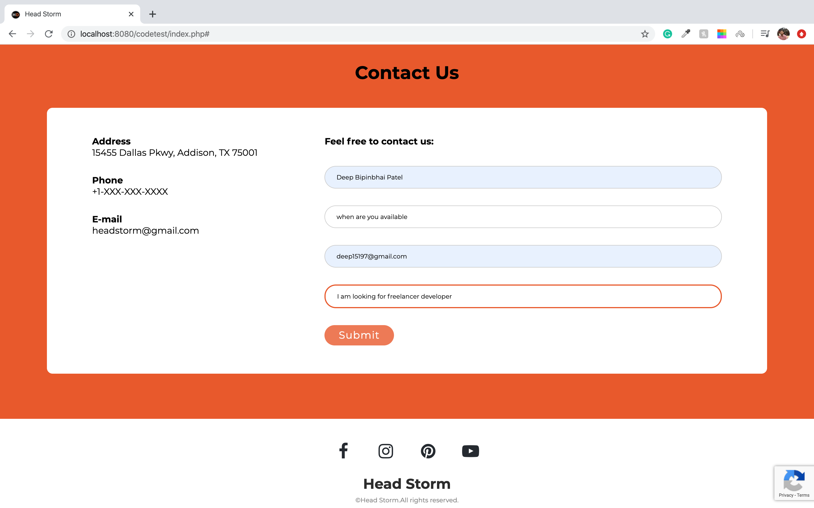
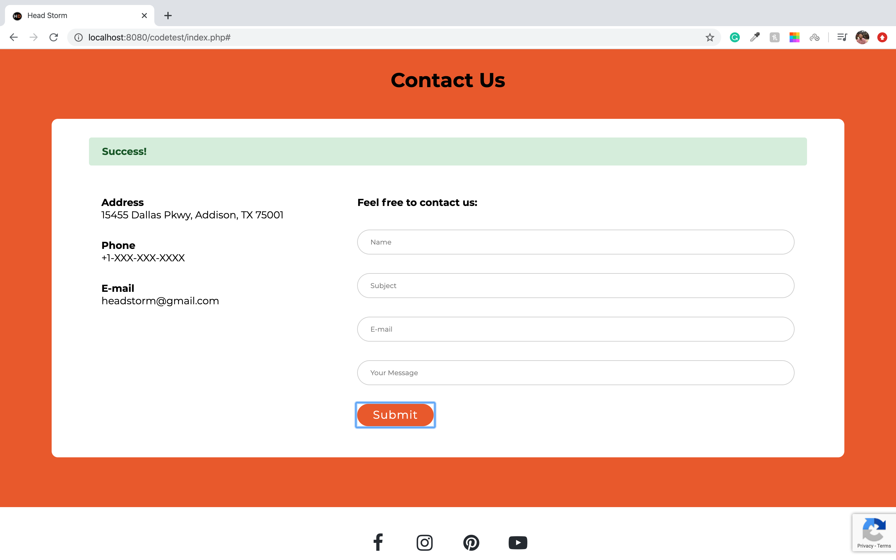
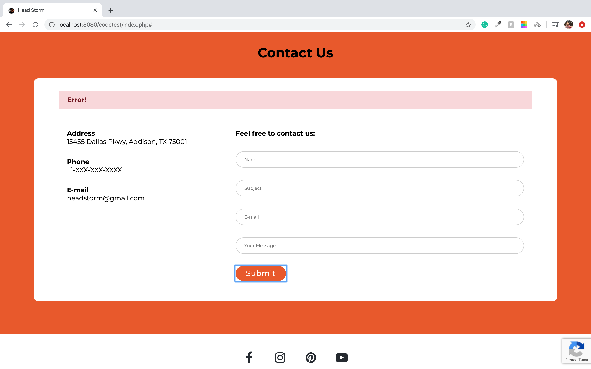
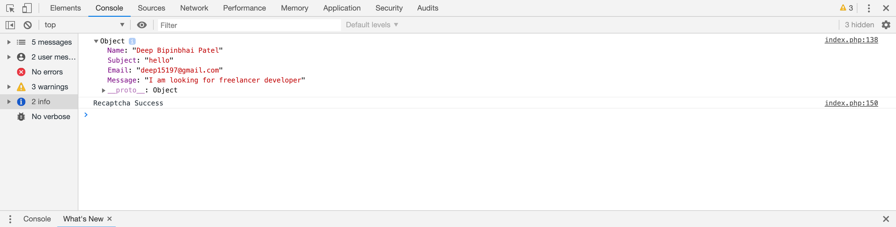

# HeadStorm-Front-end-challenge
Here is the solution of 1st front end coding challenge for Headstorm

Site link:https://www.headstorm.com/challenge/

Github Link:https://github.com/Headstorm/Interview/blob/master/challenges/README.md

##### Question

___

Front End Challenge
A company has approached you for help in developing their product and establishing an online presence. You have been tasked with quickly creating a web page for them. This page has the following requirements:

<!-- UL -->

* Company name title

* Company logo as icon in browser tab

* Contact us web form that captures contact information

* Google reCaptcha V3 implement in page. Submission of form requires Google captcha pass

* Dump all the information from the form submission to browser console. Google reCaptcha Reference: https://developers.google.com/recaptcha/docs/display

___

So I have create a page(index.php) website which includes both home and contact form. I have created my own css i.e main.css
and the webpage is responsive. For the form I have created a validation.js file to check validation based on class which is invoked before submission of the form 
to check the requirements based on the form elements. It checks every element is valid or not. To add validation such as require simply
add required class to the element and same goes to verify valid email string or not. I have also used 3rd person scroll.js it is to
add scrolling animation when clicked on contact link in the navigation bar. Lastly as per the challenge  requirement integrated Google reCaptcha V3. All the form details submitted is visible in console along with captcha message it will be success or error based on the condition if score <= 0.5 and if returns true after validing secret and response key. For more info regarding recaptcha v3 visit the [site](https://developers.google.com/recaptcha/docs/v3) and it shows green success popup or red error popup if submission had issue.

[Demo](http://deeppatel.uta.cloud/headstorm_challege1/index.php)

### Solution Screenshots of the work:

