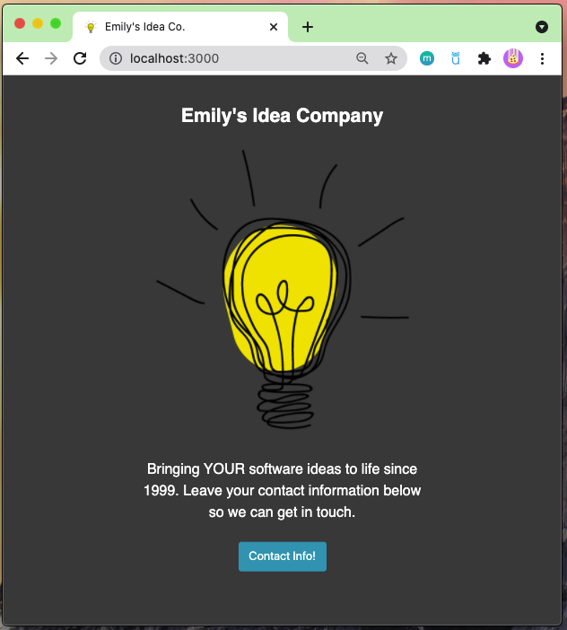

<!-- PROJECT LOGO -->
<br />
<p align="center">
  <a href="https://github.com/github_username/repo_name">
    
  </a>

  <h3 align="center">Headstorm Engineering Front End Challenge</h3>

  <p align="center">
    I made quick mock of a company (Emily's Idea Company)'s new website. 
  </p>
</p>


<!-- TABLE OF CONTENTS -->
<details open="open">
  <summary><h2 style="display: inline-block">Table of Contents</h2></summary>
  <ol>
    <li>
      <a href="#about-the-project">About The Project</a>
      <ul>
        <li><a href="#built-with">Built With</a></li>
      </ul>
    </li>
    <li>
      <a href="#how-requirements">How Requirements Were Met</a>
    </li>
    <li>
      <a href="#run-it">Run the project</a>
    </li>
    <li><a href="#usage">Improvements</a></li>
    <li><a href="#contact">Contact</a></li>
  </ol>
</details>


<!-- ABOUT THE PROJECT -->
### About The Project



### Requirements
* Company name title - The Company Title is "Emily's Idea Company".
* Company logo as icon in browser tab - You can see the logo & name in the browser tab. :) 
* Contact us web form that captures contact information - 
    * The contact form allows the user to enter their name, email, & phone number along with questions. 
* Google reCaptcha V3 implement in page. Submission of form requires Google captcha pass.
    * The user must pass the recaptcha score to submit the form. The grey button demonstrates what happens when the user does not pass the recaptcha. That of course would not really be there if this website was live, but is just an example. 
* Dump all the information from the form submission to browser console. 
    * In the developer console, you can see the form information (& recaptcha response) once the form is submitted.


### Built With

* []() Javascript/Embedded Javascript
* []() CSS
* []() HTML

### Using

* []() Node.js
* []() npm


<!-- GETTING STARTED -->
## Getting Started

To get a local copy up and running follow these simple steps.

### Prerequisites

You will need to have npm installed 
* npm
  ```sh
  npm install npm@latest -g
  ```

### Installation

1. Clone my repo :) 
2. Install NPM packages
   ```sh
   npm install
   ```

### Run The Project
3. To use google recaptcha, you may have to get new secret & site keys, registering localhost on the v3 admin site. You would need to replace them in local-server: 
```sh
   var secretKey = YOUR_SECRET_KEY
```
and index.ejs
```sh
   data-sitekey = YOUR_SECRET_KEY
```
4. Navigate to the "HFrontEndChallenge" directory 
5. Run node from the command line 
   ```sh
   node local-server.js
   ```
6. Open localhost:3000 to view my work! 

### Improvements
* Upon pressing the close button, the page would ideally not reload. I should have just made it so the closing message/form toggled between eachother. 
* I did struggle with getting the recaptcha v3 to work so I did use body parser which is depreciated. With more time, I would have found a different way to make the recaptcha v3 work. 
* There are other errors/issues in the developer that I did not have the chance to look into unfortunately. 

### Contact 
Please contact me with any issues running the code: 
* email: emm190@pitt.edu
* phone: 330-987-0225 
* linkedIn: https://www.linkedin.com/in/emilymiller21/