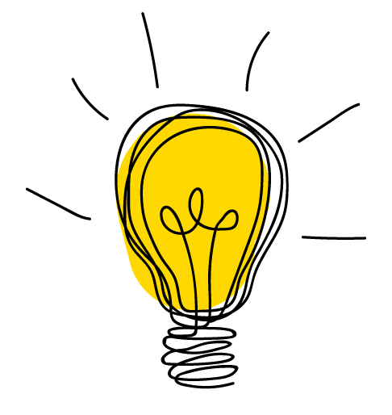

<!-- PROJECT LOGO -->
<br />
<p align="center">
  <a href="https://github.com/github_username/repo_name">
    
  </a>

  <h3 align="center">Headstorm Engineering Front End Challenge</h3>

  <p align="center">
    I made quick mock of a company (Emily's Idea Company)'s new website. 
  </p>
</p>


<!-- TABLE OF CONTENTS -->
<details open="open">
  <summary><h2 style="display: inline-block">Table of Contents</h2></summary>
  <ol>
    <li>
      <a href="#about-the-project">About The Project</a>
      <ul>
        <li><a href="#built-with">Built With</a></li>
      </ul>
    </li>
    <li>
      <a href="#run-it">Run the project</a>
    </li>
    <li><a href="#usage">Improvements</a></li>
    <li><a href="#contact">Contact</a></li>
  </ol>
</details>


<!-- ABOUT THE PROJECT -->
## About The Project


### Built With

* []() Javascript/Embedded Javascript
* []() CSS
* []() HTML

### Using

* []() Node.js
* []() npm


<!-- GETTING STARTED -->
## Getting Started

To get a local copy up and running follow these simple steps.

### Prerequisites

You will need to have npm installed 
* npm
  ```sh
  npm install npm@latest -g
  ```

### Installation

1. Clone my repo :) 
2. Install NPM packages
   ```sh
   npm install
   ```

### Run The Project
3. Navigate to the "HFrontEndChallenge" directory 
4. Run node
   ```sh
   node local-server.js
   ```

### Improvements
* Upon pressing the close button, the page would ideally not reload. I should have just made it so the closing message/form toggled between eachother. 

### Contact 
* email: emm190@pitt.edu
* phone: 330-987-0225 
* linkedIn: https://www.linkedin.com/in/emilymiller21/