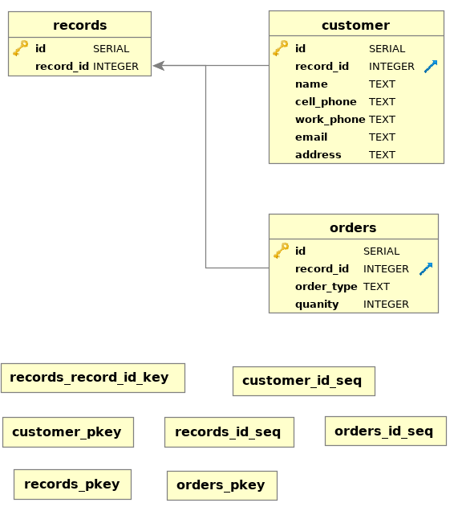

# Solution for Headstorm Database Challenge

### Part I - Relational Data Model Visualization

#### Database Visualization:

#### Other Work Product:
- A *schema.sql* file in the project root, which contains the SQL from which the visualization was generated.
- An explanation of assumptions and considerations made in designing the database, which are contained in the file *README - Applicant's Notes.txt*, which is located in the *.notes/* directory.

### Part II - Data Migration

#### Table of npm Scripts

| npm run...  | Description                                                                                                       |
|-------------|-------------------------------------------------------------------------------------------|
| test:schema | Creates database based on schema file. Prerequisite: Local installation of PostgreSQL.    |
| test:export | Exports test database headstorm_db. Prerequisites: Local installation of POstgreSQL.      |
| test:app    | Runs the script for Part II of the Database Challenge: migrateData.js. (WORK-IN-PROGRESS) |

#### Work Product
- A data file, *data/legacyRecords.json*, which is located in the *data/* folder, containing the record provided from the instructions formatted as a JSON, as well as two other mock entries for testing.
- A file *migrateData.js* which, when executed: reads data/legacyRecords.json; prints out basic postgreSQL queries that could be used to migrate the data;1 and prints out the queries again according to pg-promise query syntax.  pg-promise enables a node server to query a postgres database directly.2
- A database output file at *data/db.sql*, which shows the state of the database after the basic queries were made.

### End Notes
[1] All of the basic queries have been tested in the postgres terminal and successfully inserted data as intended into a test database. 
[2] I have not tested the pg-promise queries.
